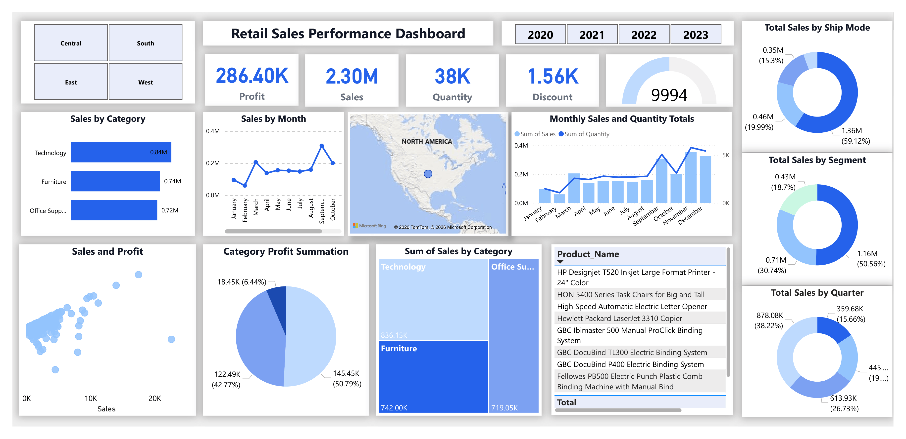

# Superstore Sales Performance Dashboard

An end-to-end data analysis project focused on extracting business insights from retail sales data using SQL and Power BI.

This project demonstrates how raw transactional data can be transformed into meaningful insights to support data-driven decision-making.

---

## Dashboard Preview

---

## Objective

The goal of this project is to analyze sales performance, identify key trends, and uncover opportunities for improving profitability and operational efficiency.

---

## Tools & Technologies

- SQL Server — Data cleaning, transformation, and KPI calculations  
- Power BI — Interactive dashboard and data visualization  
- Excel — Raw dataset source  

---

## Dataset

The dataset contains transactional retail data including:

- Sales, Profit, Quantity, Discount  
- Product Categories and Sub-categories  
- Customer Segments  
- Shipping Modes  
- Regional information (City, State, Region)  
- Order and Shipping Dates  

---

## Analysis Approach

### 1. Data Preparation (SQL)
- Cleaned and structured raw data  
- Created calculated fields and KPIs  
- Performed aggregations (monthly, yearly, category-level)  

### 2. Data Analysis
- Identified top-performing categories and products  
- Analyzed profitability across segments and regions  
- Evaluated impact of discounts on profit  
- Explored seasonal trends and growth patterns  

### 3. Data Visualization (Power BI)
- Designed an interactive dashboard for insights exploration  
- Enabled filtering by Region and Year  
- Built visuals for trends, distributions, and comparisons  

---

## Key Insights

- Q4 generates the highest sales, indicating strong seasonal demand  
- Technology leads in total sales, while Office Supplies delivers higher profit margins  
- Consumer segment contributes over 50% of total sales  
- Standard Class is the most used shipping mode (approximately 59%)  
- Higher discounts are associated with reduced profitability  
- A small group of products contributes a significant share of revenue  
- Sales peaked in 2023, showing strong business performance  

---

## Dashboard Features

- KPI cards for Sales, Profit, Quantity, and Discount  
- Monthly trend analysis for sales and quantity  
- Category-wise and segment-wise performance breakdown  
- Shipping mode and quarterly distribution analysis  
- Sales vs Profit relationship (scatter analysis)  
- Interactive filters for Region and Year  

---

## Conclusion

This project demonstrates how combining SQL and Power BI can transform raw data into actionable insights, helping businesses improve decision-making, optimize performance, and identify growth opportunities.

---

## Author

Rabail Shafeeq  
Data Analyst | SQL | Power BI